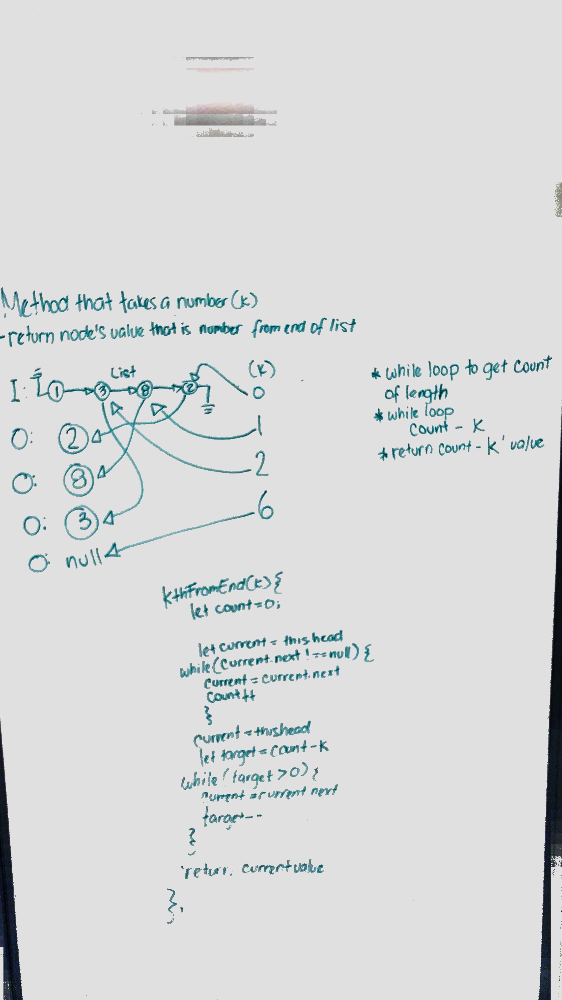
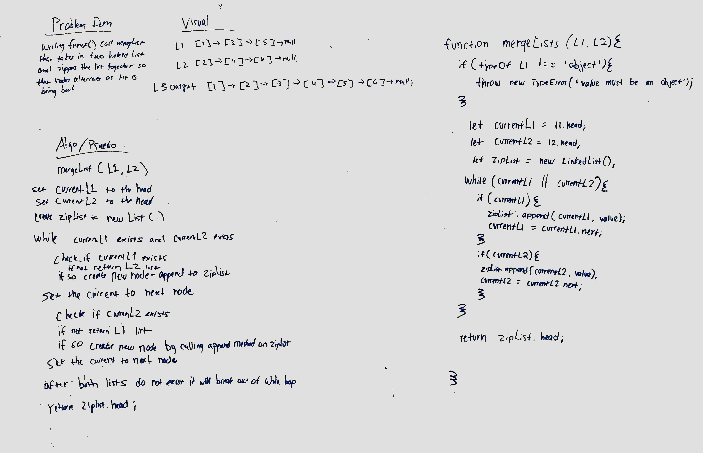

# Table of Contents

1. [Code Challenge 06](#Code-Challenge-06)
  * [link list insertions](https://github.com/KlNGU/data-structures-and-algorithms/blob/master/Data-Structures/linked-list/linked-list.js)
2. [Code Challenge 07](#Code-Challenge-07)
  * [link list kth](https://github.com/KlNGU/data-structures-and-algorithms/blob/master/Data-Structures/linked-list/linked-list.js)
3. [Code Challenge 08](#Code-Challenge-08)
  * [merge link lists](https://github.com/KlNGU/data-structures-and-algorithms/blob/master/code%20challenges/Data-Structures/ll-merge/ll-merge.js)

---

# Code Challenge 06

## Authors: Joseph Hangarter & Brandyn Vay

### Challenge
* `.append(value)` which adds a new node with the given value to the end of the list
* `.insertBefore(value, newVal)` which add a new node with the given newValue immediately before the first value node
* `.insertAfter(value, newVal)` which add a new node with the given newValue immediately after the first value node

### Approach & Efficiency

### Solution

---

# Code Challenge 07

## Authors: Joseph Hangarter & Brandyn Vay

### Challenge
* k-th value from the end of a linked list.

### Approach & Efficiency

### Solution

---

# Code Challenge 08

## Authors: Brad Smialek & Brandyn Vay

### Challenge
* merge two linked list into one.

### Approach & Efficiency

### Solution

