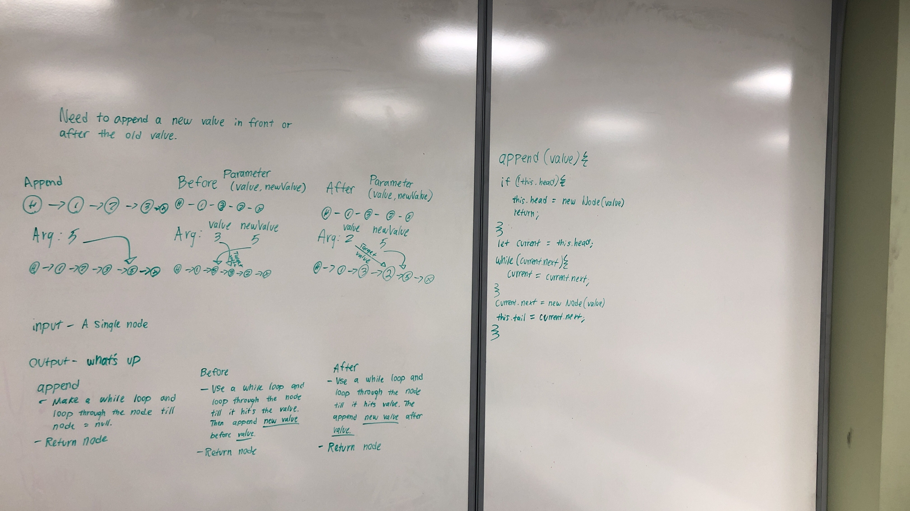

#Table of Contents
1. [Code Challenge 06](#Code-Challenge-06)
2. [Code Challenge 06](#Code-Challenge_07)

# Code Challenge 06

## Authors: Joseph Hangarter & Brandyn Vay

### Challenge
* `.append(value)` which adds a new node with the given value to the end of the list
* `.insertBefore(value, newVal)` which add a new node with the given newValue immediately before the first value node
* `.insertAfter(value, newVal)` which add a new node with the given newValue immediately after the first value node

### Approach & Efficiency

### Solution

---

# Code Challenge 07

## Authors: Joseph Hangarter & Brandyn Vay

### Challenge
* `.append(value)` which adds a new node with the given value to the end of the list
* `.insertBefore(value, newVal)` which add a new node with the given newValue immediately before the first value node
* `.insertAfter(value, newVal)` which add a new node with the given newValue immediately after the first value node

### Approach & Efficiency

### Solution

