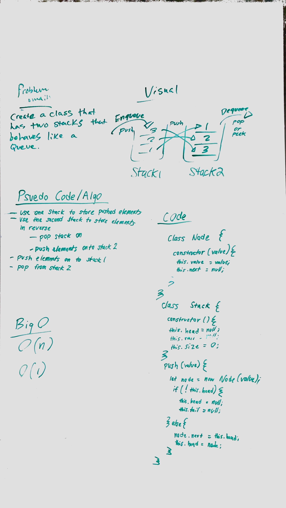
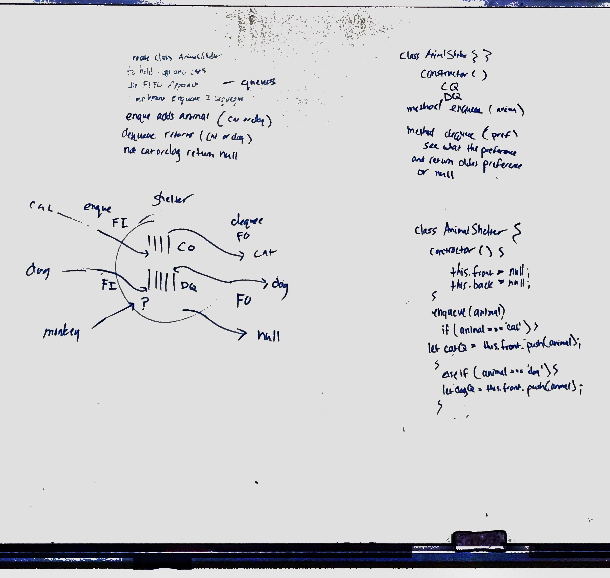
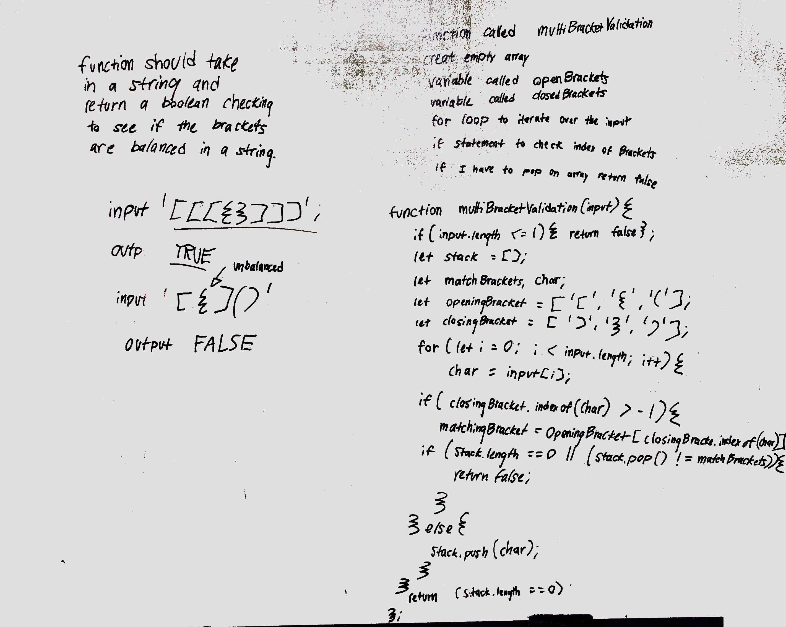
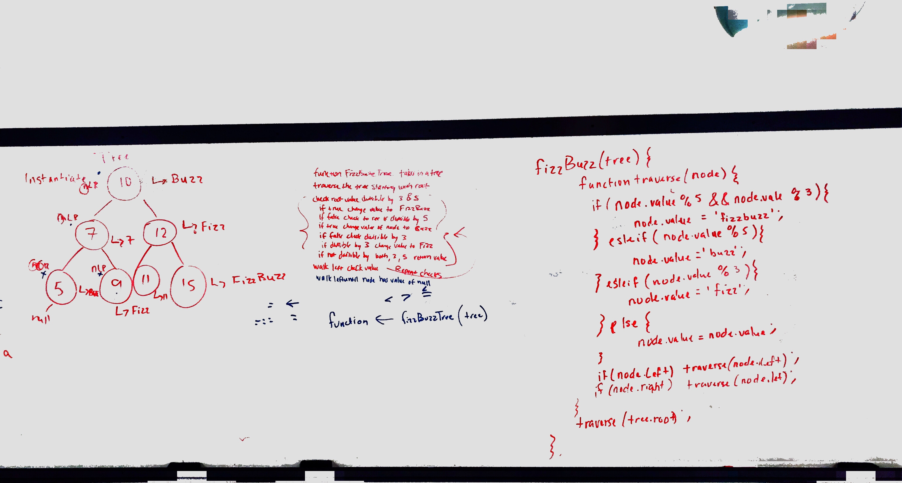
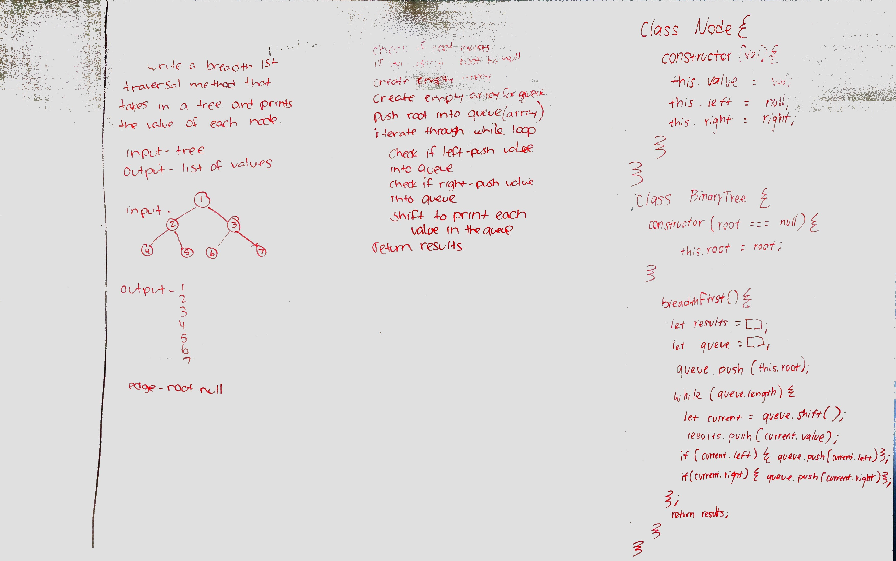
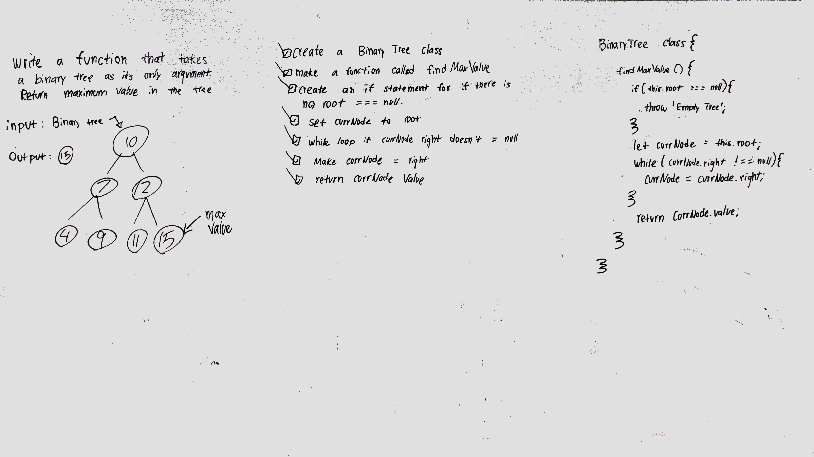
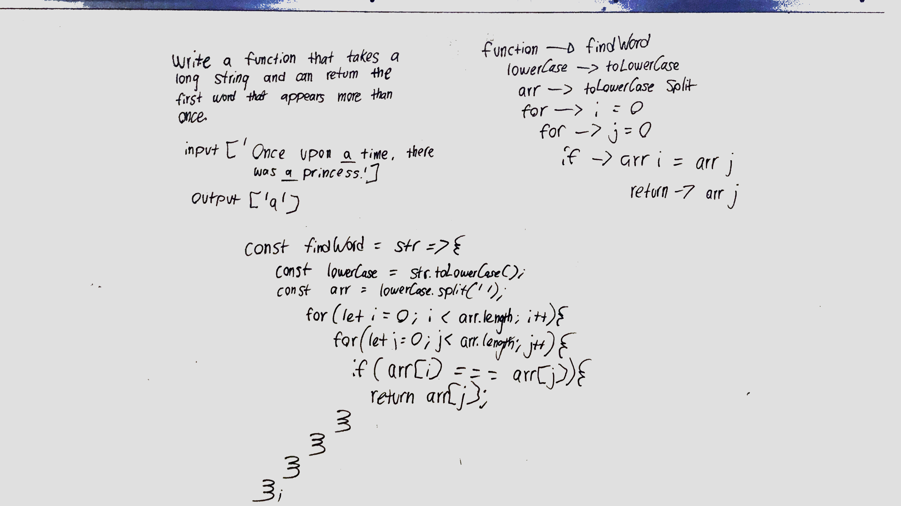
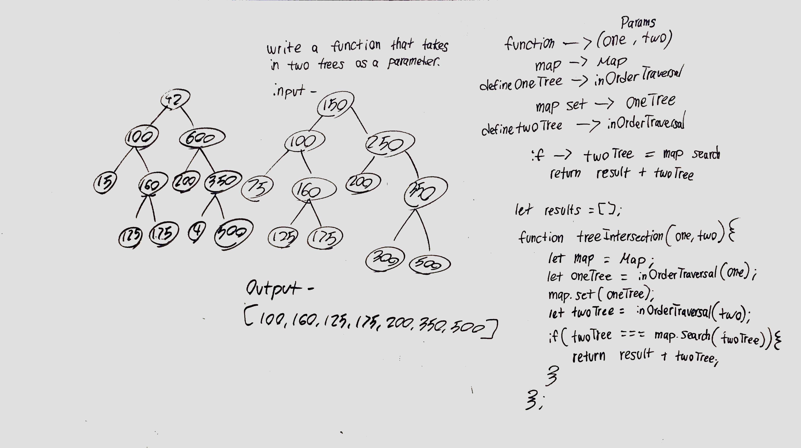
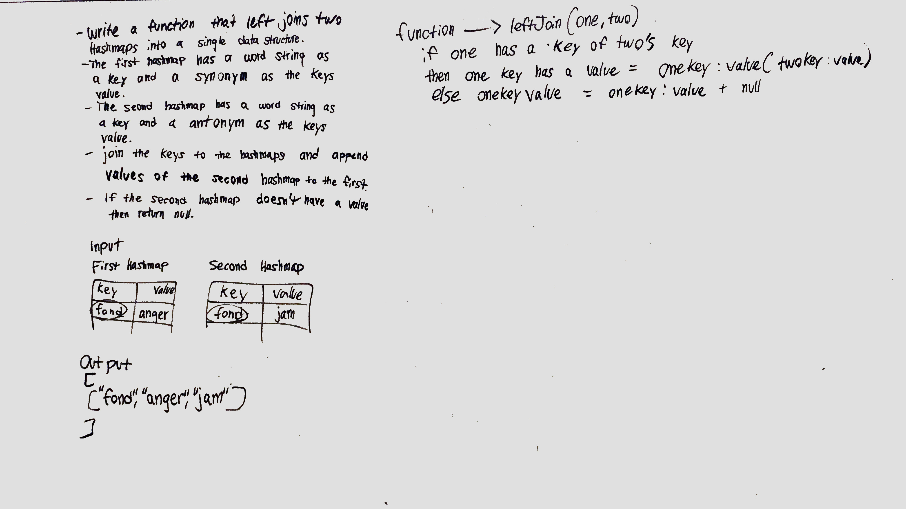

# Table of Contents
## Code Challenges
1. [Code Challenge 06](#Code-Challenge-06)
  * [link list insertions](https://github.com/KlNGU/data-structures-and-algorithms/tree/master/code%20challenges/Data-Structures/linked-list)
2. [Code Challenge 07](#Code-Challenge-07)
  * [link list kth](https://github.com/KlNGU/data-structures-and-algorithms/tree/master/code%20challenges/Data-Structures/linked-list)
3. [Code Challenge 08](#Code-Challenge-08)
  * [merge link lists](https://github.com/KlNGU/data-structures-and-algorithms/blob/master/code%20challenges/Data-Structures/ll-merge/ll-merge.js)
4. [Code Challenge 11](#Code-Challenge-11)
  * [queue with stacks](https://github.com/KlNGU/data-structures-and-algorithms/blob/master/code%20challenges/queueWithStacks/queue-with-stacks.js)
5. [Code Challenge 12](#Code-Challenge-12)
  * [fifo animal shelter](https://github.com/KlNGU/data-structures-and-algorithms/blob/master/code%20challenges/fifoAnimalShelter/fifo-animal-shelter.js)
6. [Code Challenge 13](#Code-Challenge-13)
  * [multi braket validation](https://github.com/KlNGU/data-structures-and-algorithms/blob/master/code%20challenges/multiBracketValidation/multi-bracket-validation.js)
7. [Code Challenge 16](#Code-Challenge-16)
  * [fizz buzz tree](https://github.com/KlNGU/data-structures-and-algorithms/blob/master/data-structures/fizzBuzzTree/fizz-buzz-tree.js)
8. [Code Challenge 17](#Code-Challenge-17)
  * [breadth fist](https://github.com/KlNGU/data-structures-and-algorithms/blob/master/data-structures/tree/tree.js)
9. [Code Challenge 18](#Code-Challenge-18)
  * [find maximum binary tree](https://github.com/KlNGU/data-structures-and-algorithms/blob/master/data-structures/tree/tree.js)
10. [Code Challenge 31](#Code-Challenge-31)
  * [repeated word](https://github.com/BrandynVay/data-structures-and-algorithms/blob/master/data-structures/repeatedWord/repeated-word.js)
10. [Code Challenge 32](#Code-Challenge-32)
  * [tree intersection](https://github.com/BrandynVay/data-structures-and-algorithms/blob/master/data-structures/treeIntersection/tree-intersection.js)
10. [Code Challenge 33](#Code-Challenge-33)
  * [left join](https://github.com/BrandynVay/data-structures-and-algorithms/blob/master/data-structures/leftJoin/left-join.js)

## DSA Implementation
1. [Trees](#trees)
  * [trees code](https://github.com/KlNGU/data-structures-and-algorithms/blob/master/data-structures/tree/tree.js)
2. [Hash Table](#Hash-Table)
  * [hash table code](https://github.com/BrandynVay/data-structures-and-algorithms/blob/master/data-structures/hashtable/hashtable.js)

---

# `Code Challenges`

# Code Challenge 06

## Authors: Joseph Hangarter & Brandyn Vay

### Challenge
* `.append(value)` which adds a new node with the given value to the end of the list
* `.insertBefore(value, newVal)` which add a new node with the given newValue immediately before the first value node
* `.insertAfter(value, newVal)` which add a new node with the given newValue immediately after the first value node

### Approach & Efficiency

### Solution

[back to the top](#Table-of-Contents)

---

# Code Challenge 07

## Authors: Joseph Hangarter & Brandyn Vay

### Challenge
* k-th value from the end of a linked list.

### Approach & Efficiency

### Solution

[back to the top](#Table-of-Contents)

---

# Code Challenge 08

## Authors: Brad Smialek & Brandyn Vay

### Challenge
* merge two linked list into one.

### Approach & Efficiency

### Solution

[back to the top](#Table-of-Contents)

---

# Code Challenge 11

## Authors: Brandyn Vay, Jonny Graybill, and Jeremy Lee

## Challenge
  * take two stacks and use queue implementation
  
### Approach & Efficiency

### Solution

[back to the top](#Table-of-Contents)

---

# Code Challenge 12

## Authors: Brandyn Vay, Brad Smialek

## Challenge
  * Create a class called AnimalShelter which holds only dogs and cats. The shelter operates using a first-in, first-out approach.
  
### Approach & Efficiency

### Solution

[back to the top](#Table-of-Contents)v

---

# Code Challenge 13

## Authors: Brandyn Vay, Brad Smialek

## Challenge
  * Your function should take a string as its only argument, and should return a boolean representing whether or not the brackets in the string are balanced.
  
### Approach & Efficiency

### Solution

[back to the top](#Table-of-Contents)

---

# Code Challenge 16

## Authors: Brandyn Vay, Brad Smialek

## Challenge
  * Conduct “FizzBuzz” on a tree while traversing through it. Change the values of each of the nodes dependent on the current node’s value.
  
### Approach & Efficiency

### Solution

[back to the top](#Table-of-Contents)

---

# Code Challenge 17

## Authors: Brandyn Vay, Adrienne Easton

## Challenge
  * Write a breadth first traversal method which takes a Binary Tree as its unique input. Without utilizing any of the built-in methods available to your language, traverse the input tree using a Breadth-first approach; print every visited node’s value.
  
### Approach & Efficiency

### Solution

[back to the top](#Table-of-Contents)

---

# Code Challenge 18

## Authors: Brandyn Vay, Adrienne Easton

## Challenge
  * Write a function called `find-maximum-value` which takes binary tree as its only input. Without utilizing any of the built-in methods available to your language, return the maximum value stored in the tree. You can assume that the values stored in the Binary Tree will be numeric.
  
### Approach & Efficiency

### Solution

[back to the top](#Table-of-Contents)

---

# Code Challenge 31

## Authors: Brandyn Vay

## Challenge
  * Write a function that accepts a lengthy string parameter.
  
### Approach & Efficiency

### Solution

[back to the top](#Table-of-Contents)

---

# Code Challenge 32

## Authors: Brandyn Vay

## Challenge
  * Write a function called `tree_intersection` that takes two binary tree parameters.
  
### Approach & Efficiency

### Solution

[back to the top](#Table-of-Contents)

---

# Code Challenge 33

## Authors: Brandyn Vay

## Challenge
  * Write a function that LEFT JOINs two hashmaps into a single data structure.
  * The first parameter is a hashmap that has word strings as keys, and a synonym of the key as values.
  * The second parameter is a hashmap that has word strings as keys, and antonyms of the key as values.
  * Combine the key and corresponding values (if they exist) into a new data structure according to LEFT JOIN logic.
  * LEFT JOIN means all the values in the first hashmap are returned, and if values exist in the “right” hashmap, they are appended to the result row. If no values exist in the right hashmap, then some flavor of NULL should be appended to the result row.
  * The returned data structure that holds the results is up to you. It doesn’t need to exactly match the output below, so long as it achieves the LEFT JOIN logic.
  
### Approach & Efficiency

### Solution

[back to the top](#Table-of-Contents)

---

# `DSA Implamentation`

# Trees

## Challenge
create a binary tree and a binary search tree

## Approach & Efficiency

## API
1. Binary Tree
  * `preOrder()`
  * `postOrder()`
  * `inOrder()`
2. Binary Search Tree
  * `add`
  * `contains`
  
  [back to the top](#Table-of-Contents)

---

# Hash Tables

## Challenge
Implement a Hashtable with the following methods:

  * `add`: takes in both the key and value. This method should hash the key, and add the key and value pair to the table, handling collisions as needed.
  * `get`: takes in the key and returns the value from the table.
  * `contains`: takes in the key and returns a boolean, indicating if the key exists in the table already.
  * `hash`: takes in an arbitrary key and returns an index in the collection.

## Approach & Efficiency
O(1)

## API
1. Hash Table
  * `add()`
  * `get()`
  * `contains()`
  * `hash()`
